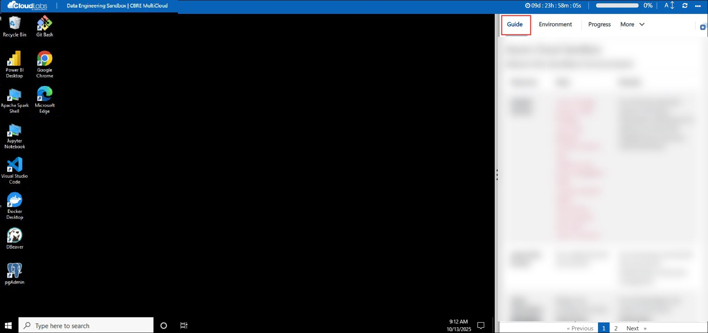
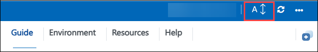
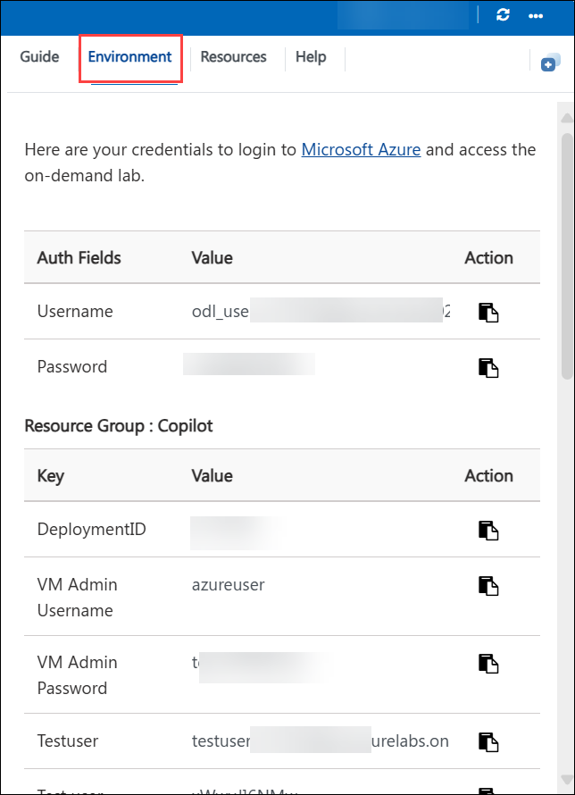
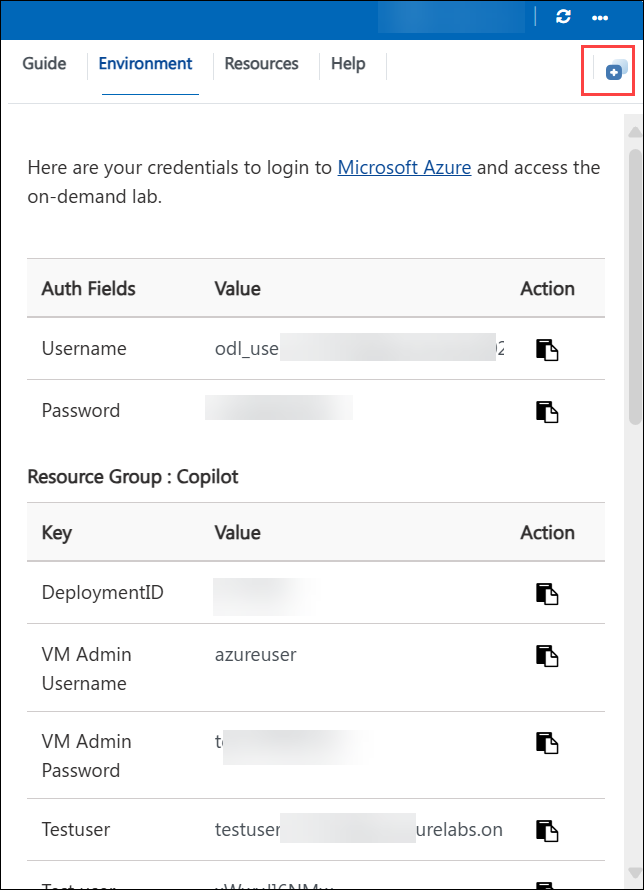
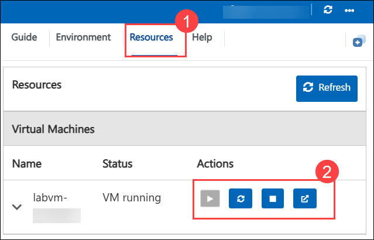
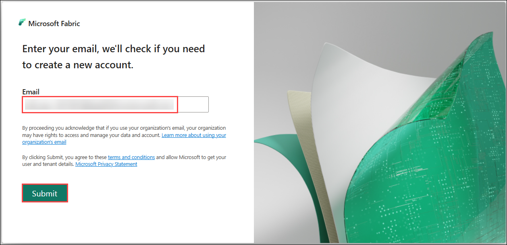
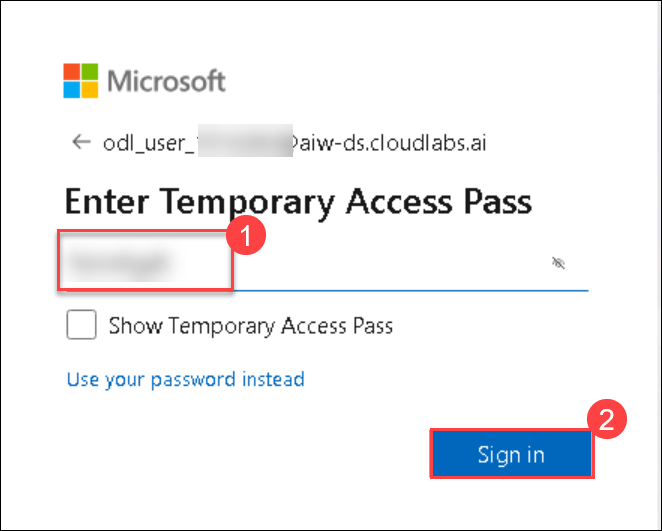
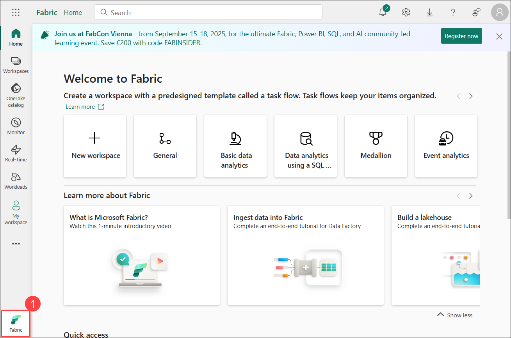
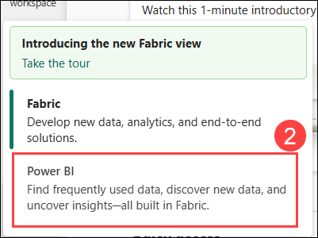
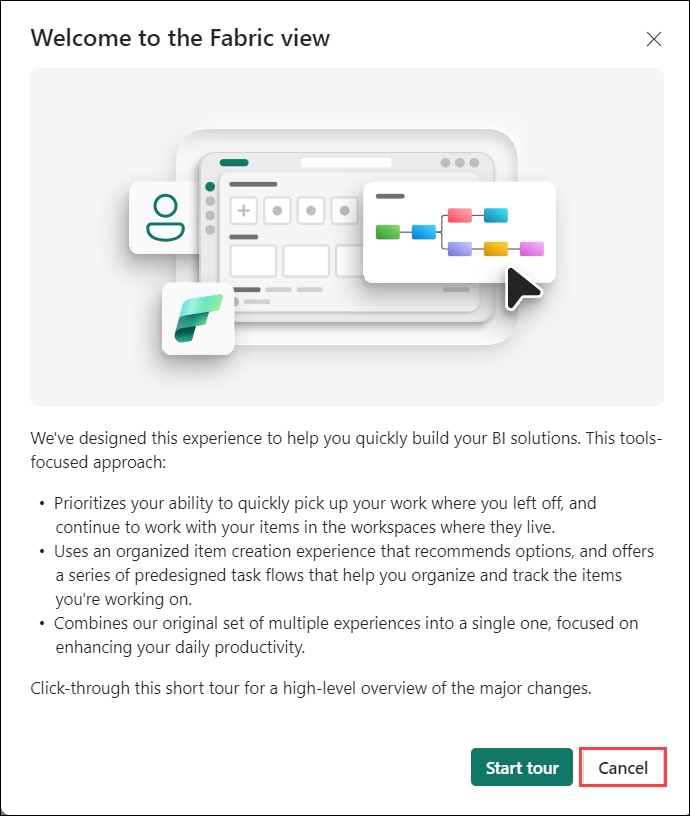

# Data Engineering Environment – Getting Started

## Accessing Your Environment

Once you're ready to dive in, your virtual machine and **instructions** will be right at your fingertips within your web browser.

## Zoom In/Zoom Out
 
To adjust the zoom level for the environment page, click the **A↕: 100%** icon located next to the timer in the lab environment.

## Exploring Your Resources
 
To get a better understanding of your resources and credentials, navigate to the **Environment** tab.
 

## Utilizing the Split Window Feature
 
For convenience, you can open the instructions in a separate window by selecting the **Split Window** button from the Top right corner.
 

## Managing Your Virtual Machine
 
Feel free to **Start, Stop, or Restart (2)** your virtual machine as needed from the **Resources (1)** tab. Your experience is in your hands!
 

## Sign in to Microsoft Fabric
 
1. Microsoft Fabric will automatically open in the browser when you access the virtual machine.
 
1. Enter the following email/username, and then click on **Submit**.

   * **Email/Username:** <inject key="AzureAdUserEmail"></inject> **(1)**
   
      
     
1. Now enter the following password and click on **Sign in (2)**.
   
   * **Temporary Access Pass:** <inject key="AzureAdUserPassword"></inject> **(1)**
   
      

     
1. Click Sign in and follow the prompts to sign into Fabric.
 
   

1. You will be directed to the Fabric Home,click on **Fabric (1)** on the bottom left corner and then select **Power BI (2).**

    

    

1. On the Welcome to Fabric view screen, click **Cancel**.

    
   
## Continue to Explore Your Environment

You are now successfully signed in and ready to begin.

Click **Next** at the bottom of this page to learn more about your virtual machine environment, available tools, and how to access the preconfigured data platforms.

   .png)
