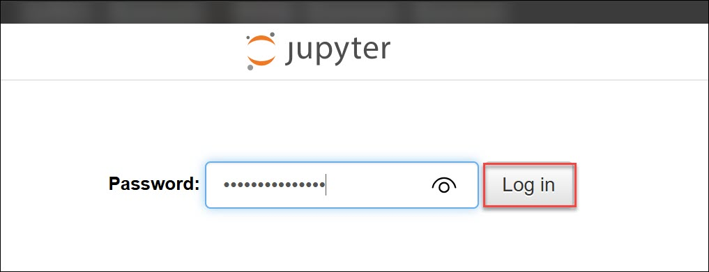
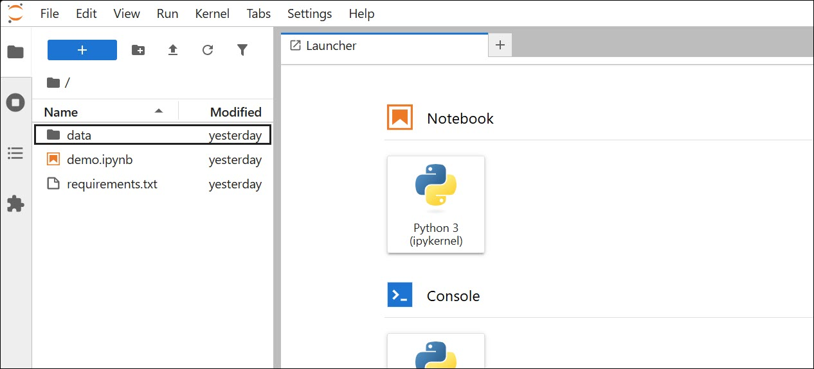

# Jupyter (Browser-Based) Environment Access Guide

A browser-based Jupyter environment hosted on ECS with secure password access for each user. Preconfigured with Python, data science libraries, and an IAM role enabling direct Amazon Bedrock integration. Users can analyze datasets, build ML workflows, and experiment with GenAI models without managing infrastructure. Designed for hands-on data science, visualization, and AI experimentation in an isolated cloud environment.

#### Follow the steps below to access your cloud-hosted Jupyter environment.

### Step 1: Access Jupyter from Browser

- Copy the Jupyter URL from the environment page.
- Paste it into your browser (Chrome or Edge recommended).
- Press Enter.

Jupyter Environment will open in your browser.

### Step 2: Login to Jupyter

- Enter the password provided on the environment page.
- Click Log in.

   

You will now enter the Jupyter workspace.

### Step 4: Explore the Preconfigured Workspace

- Your environment is already configured with:
- Python and data science libraries
- Sample notebooks and scripts
- Preloaded enterprise datasets
- Amazon Bedrock access
- S3 access 

   
You can start working immediately without any setup.

### Step 7: Troubleshooting

- If Jupyter does not open:
- Wait 2–3 minutes after Environment launch (container startup time)
- Ensure URL is opened exactly as provided
- Use Chrome or Edge browser
- Recheck password (case-sensitive)
