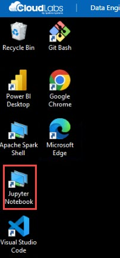
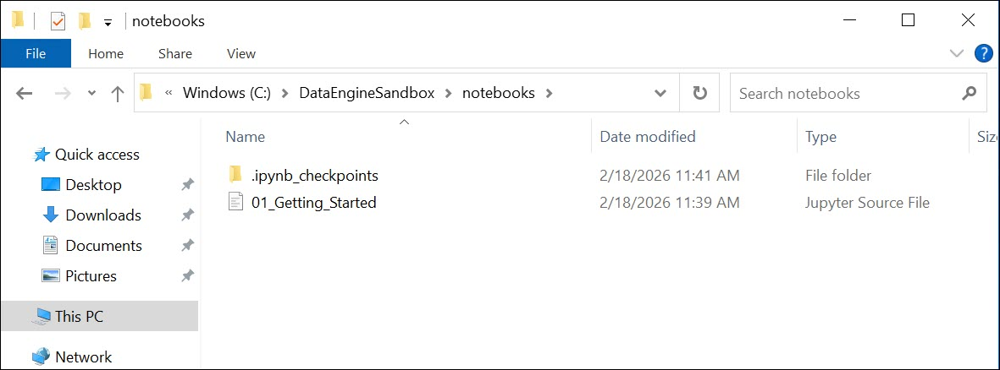
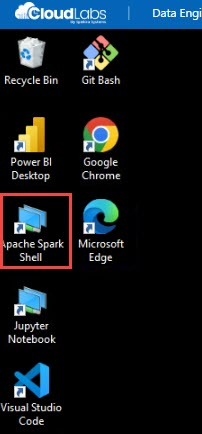

# Data Engineering Environment – User Guide

## Overview

This environment provides a ready-to-use data engineering workspace with all required tools and pre-configured data connections.

Everything is pre-provisioned.
No cloud setup or additional access is required.

You can immediately begin working with data, running notebooks, building reports, and connecting to databases.

---

# What is Included

## 1. Windows Data Engineering Environment

This virtual machine contains commonly used tools for data engineering and analytics:

* Python
* Jupyter Notebook
* Apache Spark
* Power BI Desktop
* DBeaver (database client)
* VS Code
* Git

    

**All tools are preinstalled and configured.**

---

## 2. Pre-Provisioned Databases and Services

### AWS RDS Database

A managed relational database is already deployed.

Connection details are provided in the Enviroment tab.

  

You can connect using:

* DBeaver
* Jupyter notebooks
* Power BI

No AWS login is required.

---

### Azure Fabric Workspace

A Fabric workspace and SQL endpoint are already available.

Connection details are provided in the Enviroment tab.

  
    
You can use:

* Power BI Desktop
* Jupyter (via SQL endpoint)
* Spark notebooks (optional)

No Azure portal access is required.

---

# 3. Sample Data Available in VM

Sample datasets are stored locally:

```
C:\DataEngineSandbox\data
```

  
    
Examples:

* sales.csv
* customers.csv
* logs.json

These files can be used for:

* ETL practice
* Spark processing
* Data loading into databases
* Reporting and visualization

---

# How to Start

## Open Jupyter Notebook

1. Double-click **Jupyter Notebook** icon on desktop
   
    
   
3. Navigate to:

```
C:\Data\Notebooks
```

  
    
3. Open the starter notebook
4. Run cells to begin working with sample data

---

## Connect to AWS RDS (using DBeaver)

1. Open **DBeaver** from desktop
2. Click "New Database Connection"
3. Choose PostgreSQL (or MySQL)
4. Enter details from the Enviroment tab:
   


6. Test connection → Finish

You can now run SQL queries.

---

## Connect using Power BI

1. Open **Power BI Desktop**
2. Click **Get Data**
3. Choose:

   * PostgreSQL (for AWS RDS)
   * SQL endpoint (for Fabric)
4. Enter details from the Enviroment tab:
   
    
   

6. Load data and build reports

---

## Use Spark with Local Data

Spark is preconfigured.

  
    
Example workflow:

1. Open Jupyter
2. Create new notebook
3. Load CSV data
4. Perform transformations

Spark can process:

* CSV
* JSON
* Database tables

---

