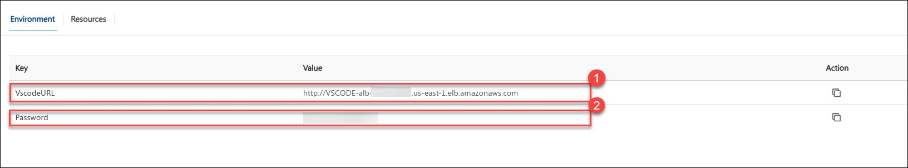
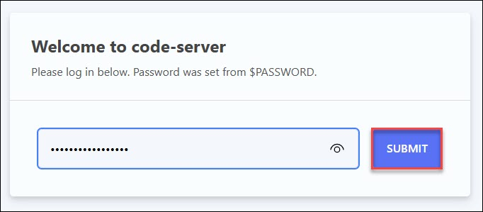

# VS Code (Browser-Based) Access Guide

Follow the steps below to access your cloud-hosted VS Code environment.

### Step 1: Open Environment Details

- After the lab is provisioned, go to the Environment page.
You will find:

    - VS Code URL(1)

    - Password(2)

   

keep this page open for reference.

### Step 2: Launch VS Code in Browser

- Copy the VS Code URL from the environment page.

- Paste it into your browser (Chrome or Edge recommended).

- Press Enter.

The browser-based VS Code interface will load.

### Step 3: Enter Password

- When prompted, enter the password provided on the environment page.

- Click on Submit

   

You will now enter the VS Code workspace.

### Step 4: Explore the Preconfigured Workspace

- Your VS Code environment is already configured with:
- Python and required extensions
- Sample scripts and notebooks
- Preloaded datasets
- Amazon Bedrock access
- S3 access (if enabled)
- Terminal access inside browser

No setup is required everything is ready to use.
