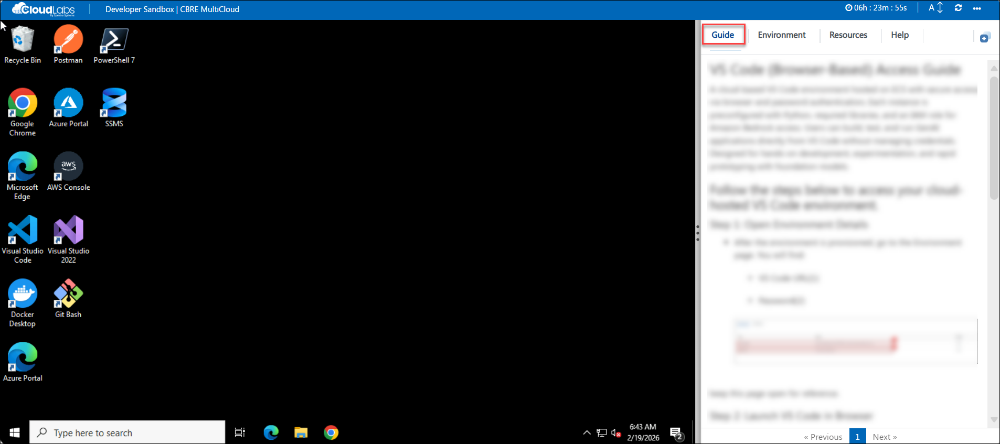
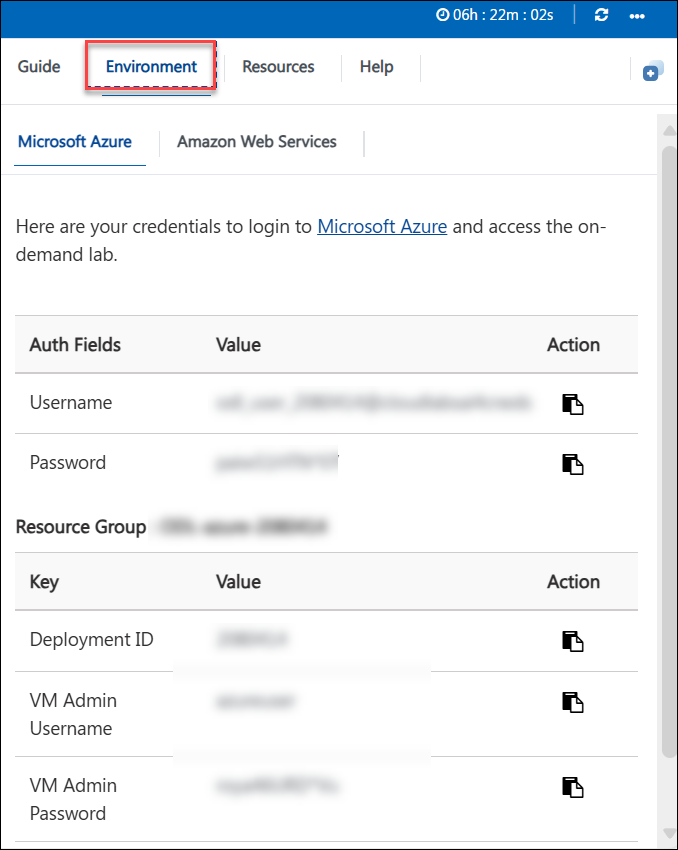
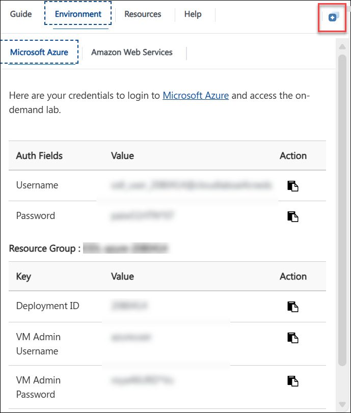
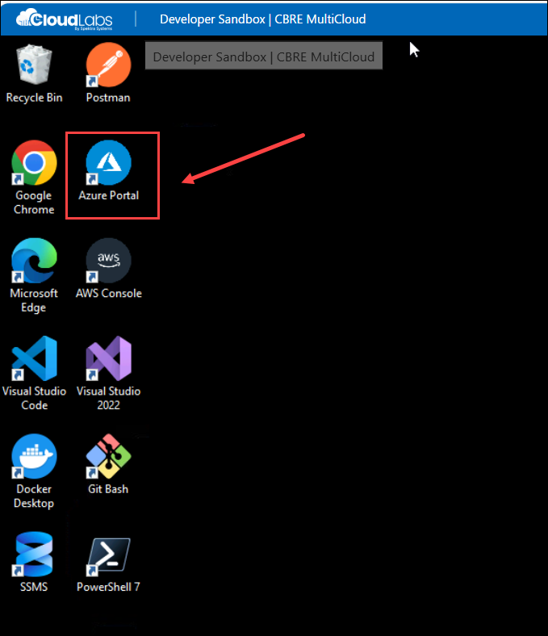
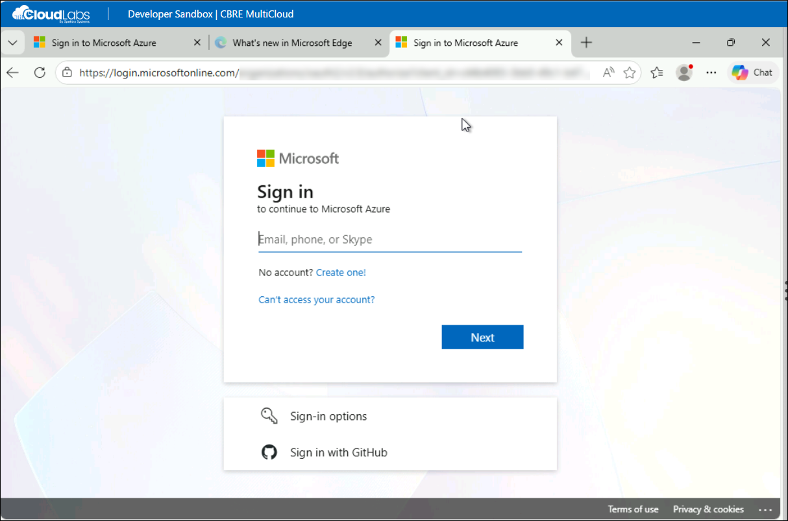
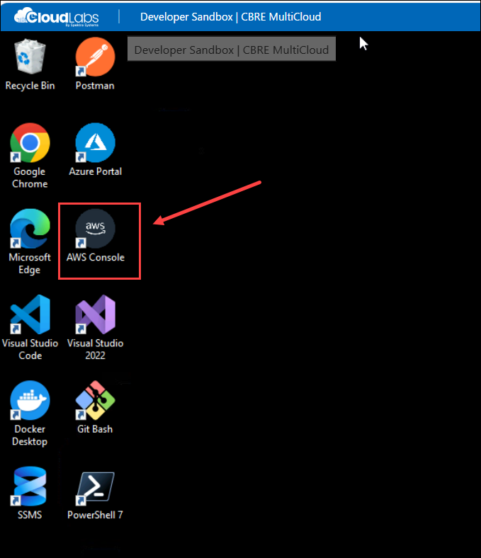
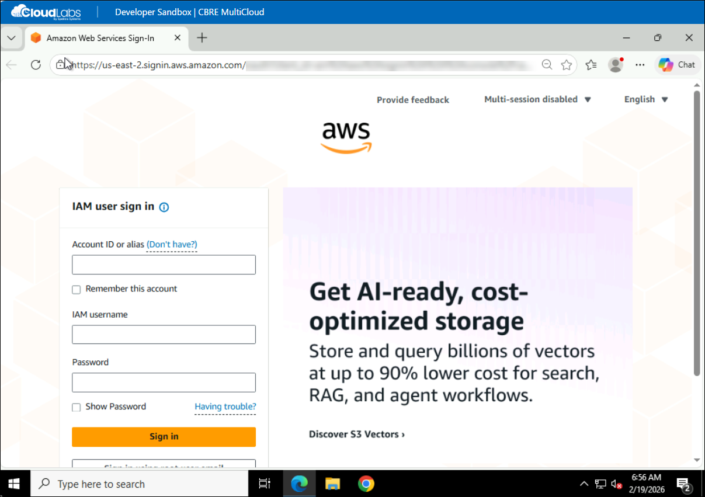

# Developer Sandbox Environment – Getting Started

## Accessing Your Environment

Once you're ready to dive in, your virtual machine and **instructions** will be right at your fingertips within your web browser.

## Zoom In/Zoom Out
 
To adjust the zoom level for the environment page, click the **A↕: 100%** icon located next to the timer in the lab environment.

## Exploring Your Resources
 
To get a better understanding of your resources and credentials, navigate to the **Environment** tab.
 

## Utilizing the Split Window Feature
 
For convenience, you can open the instructions in a separate window by selecting the **Split Window** button from the Top right corner.
 

## Managing Your Virtual Machine
 
Feel free to **Start, Stop, or Restart (2)** your virtual machine as needed from the **Resources (1)** tab. Your experience is in your hands!
 

---

## Signing in to Microsoft Azure

An **Azure Portal** shortcut is available directly on the virtual machine desktop.

- Double-click the **Azure Portal** icon.

    

- Enter the credentials provided in the **Environment** tab.

- Click **Sign In**.

    

---

## Signing in to AWS Console

An **AWS Console** shortcut is available directly on the virtual machine desktop.

- Double-click the **AWS Console** icon.

    

- Enter the credentials provided in the **Environment** tab.

- Click **Sign In** to access your AWS environment.

    

 You now have access to Azure and AWS, You can begin with creating and managing cloud resources.
---

## Understanding Your Developer Workspace

Your virtual machine is preconfigured with all required development tools, cloud CLIs, database tools, and container utilities.

You can immediately begin:

- Writing code  
- Managing infrastructure  
- Deploying containers  
- Connecting to databases  
- Working in multi-cloud environments  

Click **Next** at the bottom of this page to explore the full list of installed tools and how to use them.

   .png)
