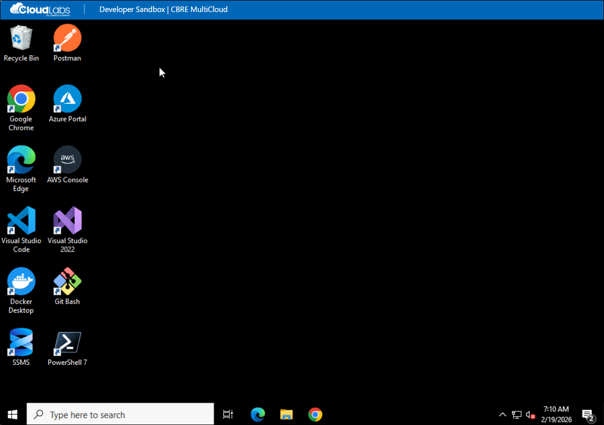

# Developer Sandbox Environment 

## Overview

This environment provides a fully equipped Windows-based development
workspace designed for modern software engineering and DevOps workflows.

All tools, SDKs, CLIs, and utilities are preinstalled and configured.



You can immediately begin:

-   Building applications
-   Managing infrastructure
-   Working with containers
-   Automating deployments
-   Developing databases

------------------------------------------------------------------------

## Installed Development Tools

### Core Development Tools

-   Visual Studio 2022 Community\
-   Visual Studio Code\
-   .NET SDK\
-   Node.js (LTS)\
-   Python\
-   OpenJDK 17\
-   PowerShell 7\
-   Git\
-   GitHub CLI

------------------------------------------------------------------------

## .NET Development

``` bash
dotnet new console -n MyApp
cd MyApp
dotnet run
```

------------------------------------------------------------------------

## Node.js Development

``` bash
npm init -y
npm install express
node index.js
```

------------------------------------------------------------------------

## Python Development

``` bash
python -m venv venv
venv\Scripts\activate
pip install flask
```

------------------------------------------------------------------------

## Docker Usage

``` bash
docker build -t myapp .
docker run -p 8080:80 myapp
docker ps
```

------------------------------------------------------------------------

## Azure CLI Usage

``` bash
az login
az group create --name DevSandboxRG --location eastus
az group list --output table
```

------------------------------------------------------------------------

## AWS CLI Usage

``` bash
aws configure
aws s3 ls
aws ec2 describe-instances
```

------------------------------------------------------------------------

## Terraform Usage

``` bash
terraform init
terraform plan
terraform apply
```

------------------------------------------------------------------------

## Kubernetes & Helm

``` bash
kubectl get nodes
helm list
```

------------------------------------------------------------------------

## Database Development

Connect using SSMS:

Server Name: localhost

Run a query:

``` sql
SELECT name FROM sys.databases;
```

------------------------------------------------------------------------

## Utilities

``` bash
curl https://api.github.com
wget https://example.com/file.zip
7z x archive.zip
```

------------------------------------------------------------------------

## Recommended Workflow

1.  Develop application code\
2.  Use Git for version control\
3.  Containerize with Docker\
4.  Provision infrastructure using Terraform\
5.  Deploy using Azure or AWS CLI\
6.  Validate APIs\
7.  Manage databases

------------------------------------------------------------------------

You are now ready to build, automate, and deploy in a fully configured
multi-cloud developer environment.
